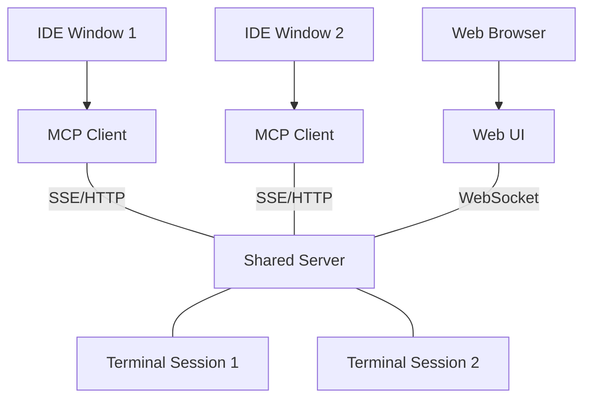

# Terminal MCP Server

A Model Context Protocol (MCP) server that provides a persistent, shared terminal environment for AI coding assistants. 

Unlike standard terminal implementations, `terminal-mcp` uses a **Shared Server architecture**. This allows multiple IDE instances, windows, or even a web browser to share and interact with the same terminal sessions seamlessly.

## Key Features

- **Persistent Sessions**: Start a process in one IDE window and monitor/control it from another.
- **Auto-Startup**: The MCP client automatically launches the shared server in the background if it's not already running.
- **Web Terminal UI**: Built-in web interface at `http://localhost:30722` to view and interact with real-time terminal output.
- **Human-Readable Aliases**: Create sessions with custom IDs (e.g., `dev-server`) instead of random UUIDs for easy tracking.
- **PTY Support**: Full interactive terminal support with incremental output reading.

## Architecture



## Tools

| Tool | Description |
|------|------|
| `start_process` | Start a new terminal process with optional alias/ID. |
| `send_input` | Send text or control characters (e.g., `\u0003` for Ctrl+C). |
| `read_output` | Read new output lines (supports incremental reading and internal cursors). |

> [!TIP]
> `read_output` now tracks a **read cursor** per session. You don't need to manage timestamps; calling it repeatedly will automatically return only the new output since the last call!
| `list_sessions` | List all active and finished sessions. |
| `get_session_info` | Get detailed state and metadata for a specific session. |
| `stop_process` | Terminate a running session. |
| `wait_until_complete` | Block until a process finishes and return its final output. |

## Quick Start

### 1. Build the project

```bash
npm install
npm run build
```

AI 코드 에디터(RooCode, Claude Desktop 등)에서 터미널 프로세스를 제어하는 MCP 서버입니다.

## Motivation 🚀

기존의 AI 코딩 툴들은 단발성 명령어(예: `ls`, `cat`, 짧은 컴파일 명령어)는 잘 실행하지만, 다음과 같은 시나리오에서는 한계가 있습니다:

1.  **백그라운드 실행 불가**: 서버나 앱을 띄워 놓고 계속해서 로그를 모니터링하기 어렵습니다.
2.  **상호작용 한계**: `flutter run`처럼 실행 중에 특정 키(`r` 키로 hot-reload 등)를 입력해야 하는 상황에 대응하기 어렵습니다.
3.  **오류 대응의 번거로움**: 실행 중 오류가 발생하면 사용자가 터미널 로그를 일일이 복사해서 AI에게 붙여넣어줘야 합니다.

**Terminal MCP**는 이러한 문제를 해결합니다. AI가 직접 터미널 세션을 유지하고, 필요할 때 로그를 읽어오며, 상호작용 키를 입력할 수 있게 해줍니다.

### 예시: Flutter 개발 📱

`flutter run -d macos`로 앱을 실행했다고 가정해 봅시다.
-   **기존**: 실행 중 오류가 나면 사용자가 로그를 복사해줘야 합니다.
-   **Terminal MCP 사용 시**: AI가 `read_output`으로 실시간 오류 로그를 즉시 확인합니다. 사용자가 오류 메시지를 복사해 줄 필요 없이, AI가 바로 "오류를 확인했습니다. 코드를 수정할까요?"라고 제안하며 작업을 이어갈 수 있습니다. 또한 수정한 뒤 `send_input`으로 `r`을 보내 즉시 Hot-reload를 트리거할 수도 있습니다.

### 2. Configure your MCP Host

Add the server to your MCP configuration (e.g., Claude Desktop, RooCode, etc.):

```json
{
  "mcpServers": {
    "terminal-mcp": {
      "command": "node",
      "args": ["/path/to/terminal-mcp/dist/client.js"],
      "env": {
        "PORT": "30722"
      }
    }
  }
}
```

### 3. Access Web UI
Once the server is running (manually via `npm run server` or automatically via client), access the visual terminal at:
`http://localhost:30722`

## License

MIT
