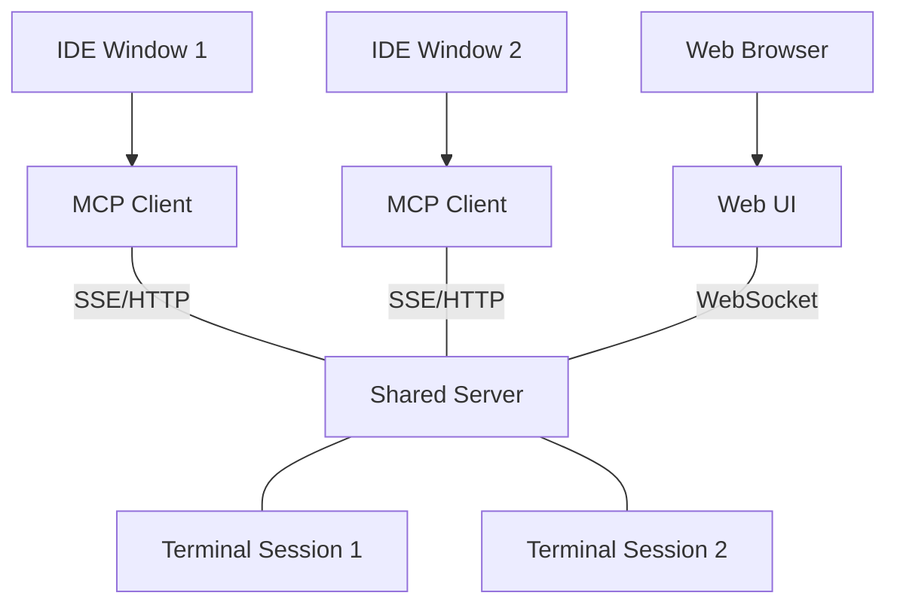

# Terminal MCP Server

A Model Context Protocol (MCP) server that provides a persistent, shared terminal environment for AI coding assistants. 

Unlike standard terminal implementations, `terminal-mcp` uses a **Shared Server architecture**. This allows multiple IDE instances, windows, or even a web browser to share and interact with the same terminal sessions seamlessly.

## Key Features

- **Persistent Sessions**: Start a process in one IDE window and monitor/control it from another.
- **Auto-Startup**: The MCP client automatically launches the shared server in the background if it's not already running.
- **Web Terminal UI**: Built-in web interface at `http://localhost:30722` to view and interact with real-time terminal output.
- **Human-Readable Aliases**: Create sessions with custom IDs (e.g., `dev-server`) instead of random UUIDs for easy tracking.
- **PTY Support**: Full interactive terminal support with incremental output reading.

## Architecture



## Tools

| Tool | Description |
|------|------|
| `start_process` | Start a new terminal process with optional alias/ID. |
| `send_input` | Send text or control characters (e.g., `\u0003` for Ctrl+C). |
| `read_output` | Read new output lines (supports incremental reading). |
| `list_sessions` | List all active and finished sessions. |
| `get_session_info` | Get detailed state and metadata for a specific session. |
| `stop_process` | Terminate a running session. |
| `wait_until_complete` | Block until a process finishes and return its final output. |

## Quick Start

### 1. Build the project

```bash
npm install
npm run build
```

### 2. Configure your MCP Host

Add the server to your MCP configuration (e.g., Claude Desktop, RooCode, etc.):

```json
{
  "mcpServers": {
    "terminal-mcp": {
      "command": "node",
      "args": ["/path/to/terminal-mcp/dist/client.js"],
      "env": {
        "PORT": "30722"
      }
    }
  }
}
```

### 3. Access Web UI
Once the server is running (manually via `npm run server` or automatically via client), access the visual terminal at:
`http://localhost:30722`

## License

MIT
